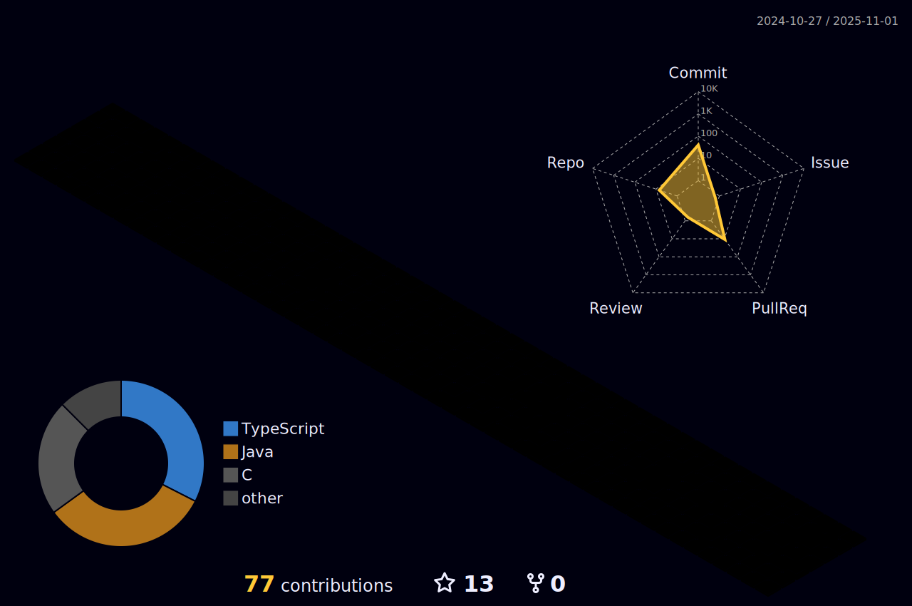

```java
public class Trizotti {
  private String name = 'Gustavo Trizotti';
  private Location location = new Location("Brazil", "SP");
  private int age = 18;
  private ArrayList<String> langs = ['Java', 'Python', 'Javascript', 'C#'];
  
  public void motivation() {
    System.out.println("Let's go!");
  }
}
```

<div align="center">
  <a href="https://www.instagram.com/gustavo.trizott1/"></a>
  <a href="https://www.linkedin.com/in/gustavo-trizotti-83b05b268/"></a>
  <a href="https://twitter.com/GustavoTrizott1"></a>
  
<div>
  
<div>

  |  | 
| :-: | :-: |

|  |  | 
| :-: | :-: | :-: |
  
</div>


