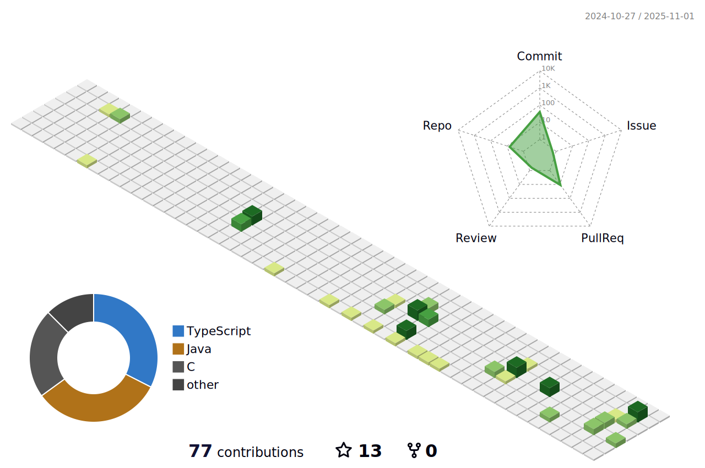

```java
public class Trizotti {
  private String name = 'Gustavo Trizotti';
  private Location location = new Location("Brazil", "SP");
  private int age = 17;
  private String[] langs = ['Java', 'Python', 'Javascript', 'C#'];
  
  public void motivation() {
    System.out.println("Let's go!");
  }
}
```

<div style="display: flex; flex-direction: row; flex: 1" align="center"> 
  
  
</div>

<div align="center">
  <a href="https://www.instagram.com/gustavo.trizott1/"></a>
  <a href="https://www.linkedin.com/in/gustavo-trizotti-83b05b268/"></a>
  <a href="https://twitter.com/GustavoTrizott1"></a>
<div>


